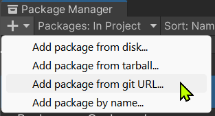
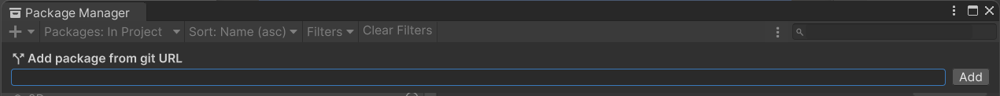
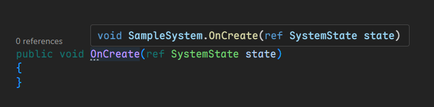
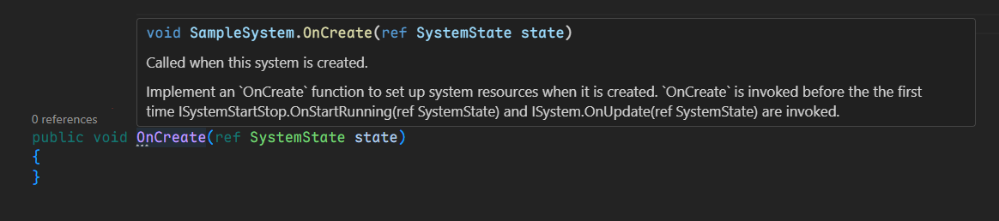

# Unity XML Documentation Generator

Both Unity and VSTU have yet supported XML Documentation for UPM packages[^1] thus there was no API documentation to display in quick info popup within IDEs (Visual Studio, VSCode, etc).

This tool was created to offer a simple workaround for the time being, until the 1st party officially rectifies this situation.

## Installation

### Requirements

- Unity 2022.3 or later

### Unity Package Manager

1. Open menu `Window` -> `Package Manager`.
2. Click the `+` button at the top-left corner, then choose `Add package from git URL...`.

    

3. Enter the package URL
    ```
    https://github.com/laicasaane/UnityXmlDocGenerator.git?path=/Packages/com.laicasaane.xml-doc-generator#1.0.0
    ```

    

### OpenUPM

1. Install [OpenUPM CLI](https://openupm.com/docs/getting-started.html#installing-openupm-cli).
2. Run the following command in your Unity project root directory:

```sh
openupm add com.laicasaane.xml-doc-generator
```

## Usage

Use the menu `Tools > Generate XML Documentation`.


This will generate a `csc.rsp` file into each the folder containing an `asmdef` file, within the `Library/PackageCache` directory.

The contents of this file should look like this:

```bash
-doc:Library/ScriptAssemblies/<ASMDEF_NAME>.xml -nowarn:1570 -nowarn:1591 -nowarn:1584 -nowarn:1658 -nowarn:419 -nowarn:1574 -nowarn:1572 -nowarn:1573 -nowarn:1587
```

> [!IMPORTANT]
> Must run this tool again when a package is updated or newly installed.
> Because the `csc.rsp` files only exist in the local cache directory `Library/PackageCache`.

## Example

- Quick info popup in VSCode before using this tool:



- After using this tool:



## Credits

- Emad on GameDev StackExchange[^2]

[^1]: https://discussions.unity.com/t/xml-comments-with-assembly-defintion/747207
[^2]: https://gamedev.stackexchange.com/a/173674
