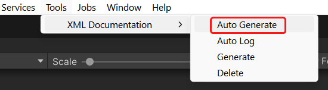
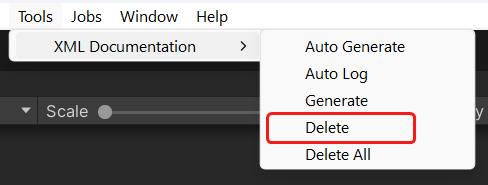

# Unity XML Documentation Generator

Both Unity and VSTU have yet supported XML Documentation for UPM packages[^1]
thus there was no API documentation to display in quick info popup within IDEs (Visual Studio, VSCode, etc).

This tool was created to offer a simple workaround for the time being,
until the 1st party officially rectifies this situation.

## Installation

### Requirements

- Unity 2022.3 or later

### Unity Package Manager

1. Open menu `Window` -> `Package Manager`.
2. Click the `+` button at the top-left corner, then choose `Add package from git URL...`.

    

3. Enter the package URL
    ```
    https://github.com/laicasaane/UnityXmlDocGenerator.git?path=/Packages/com.laicasaane.xml-doc-generator#1.0.5
    ```

    

### OpenUPM

1. Install [OpenUPM CLI](https://openupm.com/docs/getting-started.html#installing-openupm-cli).
2. Run the following command in your Unity project root directory:

```sh
openupm add com.laicasaane.xml-doc-generator
```

## Usage

### Generate XML Documentation

Use the menu `Tools > XML Documentation > Generate`.


This will generate a `csc.rsp` file into each the folder containing an `asmdef` file,
within the `Library/PackageCache` directory.

The contents of this file should look like this:

```bash
-doc:./Library/XmlDocumentationGenerated/<ASMDEF_NAME>.xml
-nowarn:419
-nowarn:1570
-nowarn:1572
-nowarn:1573
-nowarn:1574
-nowarn:1584
-nowarn:1587
-nowarn:1591
-nowarn:1658
```

Because Unity will delete all files within `Library/ScriptAssemblies` on every domain reload,
the XML documentation files cannot be permanently stored there.
As a result, they must be generated into the `Library/XmlDocumentationGenerated`,
then copied over to the `Library/ScriptAssemblies` on domain reload.

> [!NOTE]
> Original `csc.rsp` files within the `Library/PackageCache` directory will be renamed to `.csc-rsp-backup`
> before new contents are appended to them.

> [!NOTE]
> Additional `.XMLDOC_CSC_RSP_GENERATED` files will be generated into the same folder to indicate that
> the `csc.rsp` file has been modified by this tool, and to prevent subsequent executions from modifying it again.

### Auto Generate on Domain Reload

By default, when a UPM package is installed, updated or uninstalled, we must invoke
`Tools > XML Documentation > Generate` again.
Because modified files within `Library/PackageCache` will be reverted to their original
state, while local added files will be deleted.

Automatic generation can be achieved by enabling the menu option `Tools > XML Documentation > Auto Generate`.



> [!NOTE]
> Additionally, there is the menu option `Tools > XML Documentation > Auto Log` to notify
> when the XML documentation files are automatically generated on domain reload.

> [!NOTE]
> Any XML file locates at `Library/XmlDocumentationGenerated` will be copied to
> `Library/ScriptAssemblies` even if `Auto Generate` is disabled.

### Delete XML Documentation

Use the menu `Tools > XML Documentation > Delete`.



This will delete all generated files within the `Library/PackageCache` directory
and revert the original `csc.rsp` files if any were modified by this tool.

Finally, it will also delete the `Library/XmlDocumentationGenerated` directory.

## Results

- Before having XML documentation:


- After:


## Credits

- Emad on GameDev StackExchange[^2]

[^1]: https://discussions.unity.com/t/xml-comments-with-assembly-defintion/747207
[^2]: https://gamedev.stackexchange.com/a/173674
